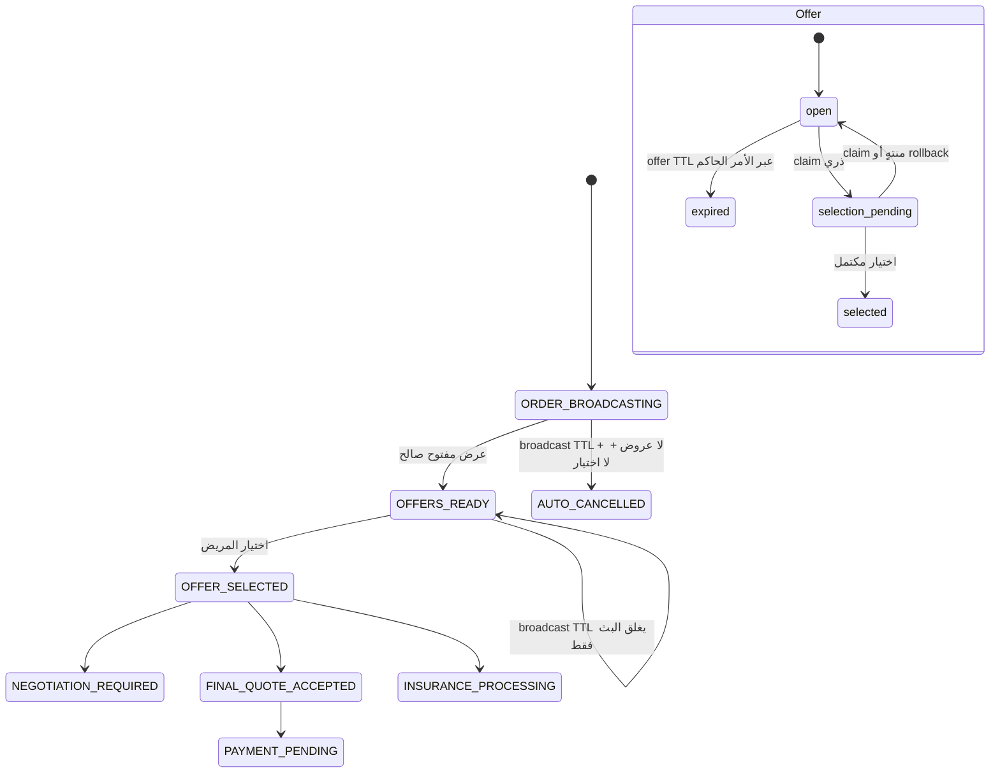

# حزمة مراجعة — انتهاء عروض وبث الصيدلية الساكنة (PR #18)

> هذه حزمة **مراجعة فقط**. لا تسجل scheduler أو worker أو cron أو Redis، ولا تنفذ migration، ولا تنشر التطبيق أو تطلب دمج الفرع.

## المصدر والنطاق

الالتزام الأساسي هو `3c8f91f5a001b3e0cdcb301c10df17e49c032a89` على الفرع `feature/patient-production-pharmacy-expiry-static`، فوق PR #17. يضيف الحزمة الساكنة الأمر الحاكم `expireDuePharmacyOffers(now, cursor, limit)`، نماذج expiry/audit/outbox/lease، artifact فهرسة يدوي قابل للتراجع، واختبارات موجهة. التعديل اللاحق في هذا الطلب يعطّل المنسح الإداري القديم ويجعل قراءة عروض المريض بلا كتابة لكي يبقى هذا الأمر الكاتب الوحيد للانتهاء.

## مخطط الحالات

لا تتأثر `selected` أو `PAYMENT_PENDING` أو `INSURANCE_PROCESSING` بانتهاء broadcast؛ لها مهلات وسياسات مستقلة مؤجلة.

## التحقق المنفذ

| الحالة | الدليل |
|---|---|
| انتهاء offer مفتوح | انتقال شرطي إلى `expired` مع سبب ووقت ونسخة، ثم audit/outbox. |
| retry / restart | reconciliation للـ`expiry_artifacts_pending` وupsert بالمفتاح المكرر نفسه. |
| outbox duplicate | `pharmacy-expiry:<entity>:<id>:v<version>` مع `upsert`. |
| concurrent select | claim `selection_pending` وتحديث مشروط؛ لا يعيد الانتهاء حالة الاختيار الفائز. |
| OFFER_READY | يغلق broadcast فقط؛ لا يلغي الطلب أو العروض. |
| cursor | يستأنف المسح بعد `offer_after` بترتيب `id`. |
| legacy expiry | endpoint الإداري القديم يعيد 410 ولا ينفذ تحديثات انتهاء. |

تمت مراجعة `git diff --check` وتشغيل الاختبارات الموجهة محلياً بنجاح (29 اختباراً قبل إضافة اختبارات الانحدار في هذا الالتزام). الفحص الكامل المحلي لـTypeScript لم يكتمل بسبب OOM في sandbox؛ لا يعد ذلك نجاحاً محلياً للفحص الشامل. بوابات CI في PR هي الدليل عن build/test الشامل للالتزام المنشور، ويلزم أن تعاد بعد هذا التعديل اللاحق.

## الترحيل والاسترجاع

ينشئ `up` في `backend/migrations/20260827_pharmacy_expiry_static.mjs` الفهارس المسماة فقط. يعكس `down` ذلك بحذف تلك الفهارس بالأسماء فقط. لا ينفذ هذا الطلب أي migration أو rollback، ولا يحذف records أو يعيد stock أو يلغي payment أو يرسل notifications.

## القرار المطلوب من المراجع

يراجع المراجع استقلال الأمر الحاكم، شروط السباق، حدود الملاحظة، وسلامة الترحيل قبل أي دمج. تبقى قرارات runner ومراقبته وهوية الاستدعاء محجوبة حتى تتحدد مهلة التأخر والحجم وحالة Redis.
