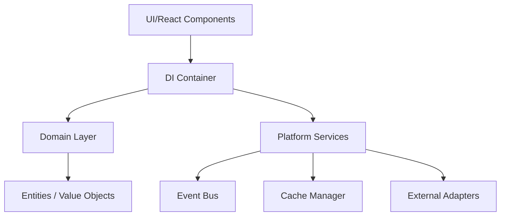
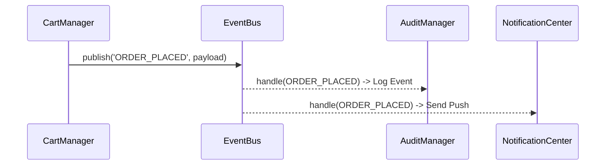
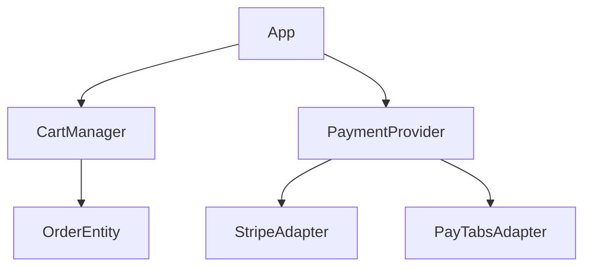
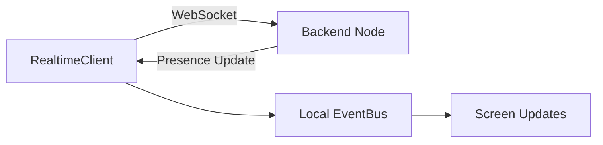

# Phase 1B — Core Platform Services & Business Infrastructure

**Status:** 🟢 **COMPLETED**
**Date:** July 13, 2026
**Target:** Reusable Business Infrastructure

## 1. Scope & Objective
Phase 1B established the core Domain and Service layers for all future business modules (Pharmacy, Doctors, Labs, etc.). No end-user UI features were built; the entire phase focused on robust, decoupled backend architecture.

## 2. Delivered Batches
- **Batch 1 (Domain Layer):** Domain-Driven Design structure (`Entities`, `ValueObjects`), `DIContainer`.
- **Batch 2 (User Platform):** `UserProfileService`, `RoleManager` (RBAC), `AuditManager`.
- **Batch 3 (Search & Discovery):** `SearchEngine`, `LocationService`.
- **Batch 4 (Media & Comm):** `MediaManager`, `RealtimeClient`.
- **Batch 5 (Booking):** `ScheduleManager`, `QueueEngine`.
- **Batch 6 (Commerce):** `CartManager`, `PaymentProvider` (Abstraction).
- **Batch 7 (Notifications):** `MessagingService`, `NotificationCenterManager`.
- **Batch 8 (Business Services):** `FavoritesManager`, `ReviewManager`, `LoyaltyManager`.
- **Batch 9 (Integration):** `Adapters`, `JobManager`, `EventBus`, `CacheManager`.

## 3. Architecture Diagrams

### Dependency Map

### Event Flow (Event Bus)

### Commerce Architecture

### Realtime Architecture

## 4. API Contract Summary
All services are exposed strictly via the `DIContainer`.
- No singletons are directly exported (except the container).
- Providers implement standard TS `Interfaces` located in `src/core/platform/integration/`.

## 5. RBAC Permission Matrix
| Role | Permissions |
|------|-------------|
| **Guest** | - |
| **Patient** | `view_medical_records`, `view_orders` |
| **Doctor** | `view_medical_records`, `edit_medical_records`, `prescribe_medication` |
| **Admin** | `access_admin_dashboard`, `manage_users`, `manage_roles` |

## 6. Next Steps (Phase 1C)
The planned **Phase 1C** covers:
- **Auth Implementation:** Connecting `AuthManager` with Firebase/Supabase (Email, Phone, OAuth).
- **Data Layer:** Concrete Repository implementations integrating with a local SQLite database (WatermelonDB or generic sqlite) and a remote API.
- **Offline Sync:** Connecting the `JobManager` and `EventBus` to push offline transactions when the network is restored.

> [!IMPORTANT]
> Phase 1B is fully executed with 0 TypeScript errors. Please review the deliverables. If you approve, we are ready to move into Phase 1C.

## 7. Architectural Refinements (Final Additions)
The following patterns were introduced to fortify the domain layer:
- **Repository Contracts**: IRepository and IBaseRepository for standard data access.
- **DTO Architecture**: Standardized RequestDTO, ResponseDTO, and ValidationDTO.
- **Mapper Layer**: BaseMapper for bridging Entities, DTOs, and API models.
- **Result Pattern**: A unified Result<T> structure instead of throwing errors.
- **Unified Error Model**: DomainError, ValidationError, ApiError, etc.
- **Generic Pagination Models**: Cursor and Offset pagination standards.
- **Specification Pattern**: Encapsulating complex business rules in reusable specifications.
- **Commerce VO**: Value objects for Currency, Tax, Percentage, and Discount.
- **Time & Date**: TimeService abstraction over native dates.
- **ID Generation**: IdGenerator utilizing expo-crypto for UUIDv4.
